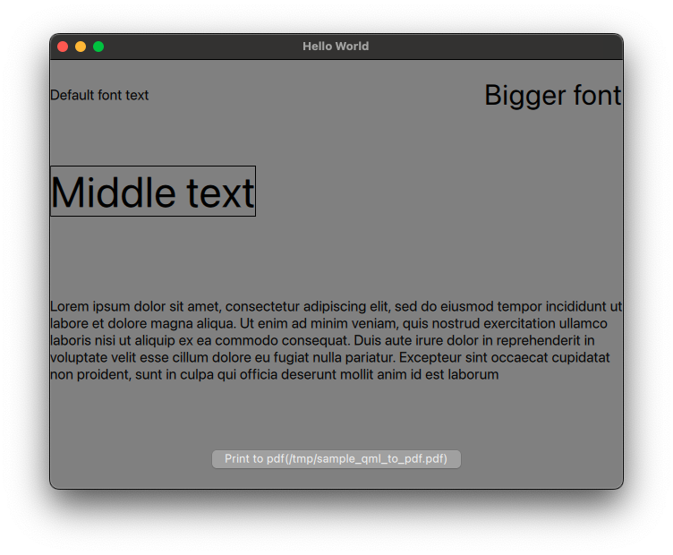

# concept-qml-to-pdf

A simple proof of concept for printing qml items to pdf. 

If you want a quick and easy way of creating a pdf file for a page in your app(and without having to change the application) you can simply grab an image and add it to a pdf file. See a sample here of how that pdf could look like: [sample_qml_image](sample_qml_image.pdf)

However, there are some disadvantages. The disadvantage tackled for this proof of concept is that you aren't able to select the text in the pdf file. But the idea could be extended to other items that you don't want to be exported as an image but rather as a native pdf element. 

The idea is really simple: gather all the text items visible on screen and render them over the image using QPainter::drawText(which will generate a selectable text in the resulting pdf). 

It will be a challenge to make the text drawn with QPainter::drawText to look exactly like the one in the application but I think it's possible by just extracting the QTextOptions from the qml Text item. 

This could be a good and easy solution to some specific usecase. Here is a resulting pdf file with the text added above the image: [sample_qml_to_pdf.pdf](sample_qml_to_pdf.pdf)

This is how the original qml application looks like:
